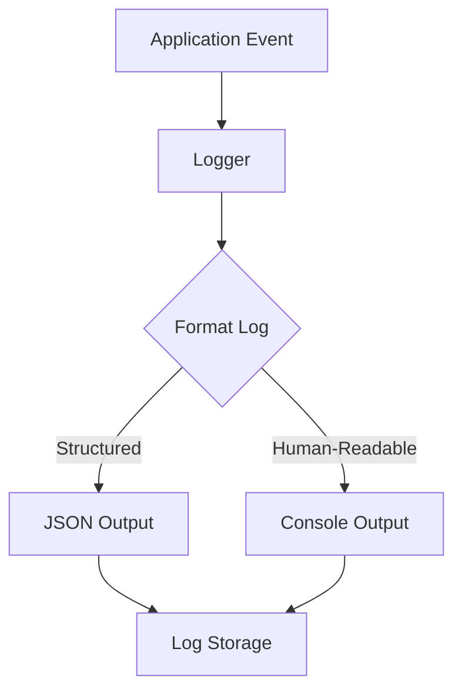

## 1.1 Logback Logging Templating

- Use parameterized messages for efficient logging and to avoid unnecessary string concatenation.
- Example usage:
  ```java
  log.info("User {} logged in from IP {}", userId, ipAddress);
  log.error("Failed to process order {}: {}", orderId, exception.getMessage());
  ```
- Always use `{}` as placeholders and pass parameters as arguments.
- Do not use string concatenation or String.format in log statements.
- This approach defers string formatting until the log level is enabled, improving performance.# Logging Structuring and Formatting Guidelines

## 1. Log Structure

- **Timestamp**: Use ISO 8601 format (e.g., `2025-07-21T18:31:33Z`).
- **Log Level**: Standard levels: `TRACE`, `DEBUG`, `INFO`, `WARN`, `ERROR`.
- **Component/Module**: Indicate the source (e.g., class or subsystem).
- **Message**: Clear, concise, actionable.
- **Context**: Add relevant fields (user ID, request ID, etc.).
- **Exception**: For errors, include stack traces and exception types.

### 1.1 Logback Logging Templating

- Use parameterized messages for efficient logging and to avoid unnecessary string concatenation.
- Example usage:
  ```java
  log.info("User {} logged in from IP {}", userId, ipAddress);
  log.error("Failed to process order {}: {}", orderId, exception.getMessage());
  ```
- Always use `{}` as placeholders and pass parameters as arguments.
- Do not use string concatenation or String.format in log statements.
- This approach defers string formatting until the log level is enabled, improving performance.

## 2. Formatting

- **Structured Logging**: Prefer JSON or key-value pairs.
  - Example (JSON):  
    ```json
    {
      "timestamp": "2025-07-21T18:31:33Z",
      "level": "INFO",
      "component": "NotificationService",
      "message": "Notification sent",
      "userId": "12345",
      "requestId": "abc-678"
    }
    ```
- **Human-Readable**: For console output:
  ```
  2025-07-21T18:31:33Z INFO [NotificationService] Notification sent userId=12345 requestId=abc-678
  ```

## 3. Best Practices

- **Consistency**: Use the same structure and fields everywhere.
- **No Sensitive Data**: Never log passwords, tokens, or personal data.
- **Contextual Logging**: Pass context (request ID, user ID) through all log statements.
- **Error Logging**: Always log the full exception and context for errors.
- **Log Rotation**: Ensure logs are rotated and archived.

## 4. Example (Mermaid Diagram)



---

These guidelines ensure logs are useful for debugging, monitoring, and auditing.